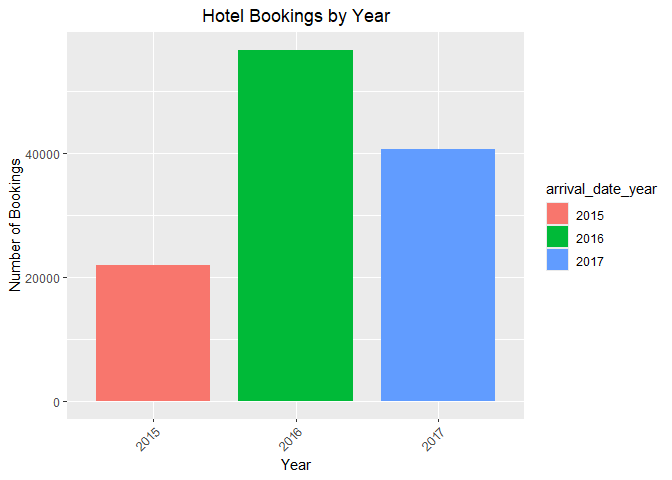

### Research topic: Hotel Booking Data

### Team members: Kaitlyn Hoyme and Christopher Moseley

### Introduction:

This report will demonstrate various relationships between variables
surrounding hotel booking data. We will examine these variables in order
to determine how they affect each other and hotel bookings. This data
would be of interest to businesses like hotels, as they can adjust these
factors to improve their profit and customer satisfaction.

### Data:

This dataset includes information on hotel booking data from two hotels,
one a city hotel, the other a resort hotel, between the 1st of July 2015
and 31st of August 2017.

There are 119390 rows of 36 variables.  
Variables are:  
- hotel : States what hotel the row represents data from. City Hotel or
Resort Hotel.  
- is_canceled : value that indicates if the booking was canceled (1) or
not (0).  
- lead_time : Number of days that occurred between the entering date of
the booking into the PMS and the arrival date.  
- arrival_date_year : The year of the arrival date (values are between
2015-2017).  
- arrival_date_month : Month of arrival date. Categorical variable with
values “January” through “December”.  
- arrival_date_week_number : Week number of the arrival date.  
- arrival_date_day_of_month : Day of the month of the arrival date.  
- stays_in_weekend_nights : Number of weekend nights (Saturday or
Sunday) the guest stayed or booked to stay at the hotel.  
- stays_in_week_nights : Number of week nights (Monday-Friday) the guest
stayed or booked to stay at the hotel.  
- adults : Number of adults.  
- children : Number of children.  
- babies : Number of babies.  
- meal : Represents the type of meals offered by the hotel. Ex: BB = Bed
& Breakfast.  
- country : Country of origin.  
- market_segment : Market segment designation. In categories
(categorical). “TA” means travel agents, and “TO” means tour operators  
- distribution_channel : Booking distribution channel. The term “TA”
means travel agents, and “TO” means tour operators.  
- is_repeated_guest : Value indicating if the booking name was from a
repeated guest (1) or not (0).  
- previous_cancellations : Number of previous bookings that were
cancelled by the customer prior to the current booking.  
- previous_bookings_not_canceled : Number of previous bookings not
cancelled by the customer prior to the current booking.  
- reserved_room_type : Code of room type reserved.  
- assigned_room_type : Code for type of room assigned to the booking.
Sometimes the assigned room type differs from the reserved room type due
to hotel operation reasons (eg overbooking) or by customer request.  
- booking_changes : Number of changes/amendments made to the booking
from the moment the booking was entered on the PMS until the moment of
check-in or cancellation.  
- deposit_type : Represents deposit type. No Deposit - no deposit was
made; Non Refund - a deposit was made in the value of the total stay
cost; Refundable - a deposit was made with a value under the total cost
of stay.  
- agent : ID of the travel agency that made the booking.  
- company : ID of the company/entity that made the booking or
responsible for paying the booking. ID is presented instead of
designation for anonymity reasons.  
- days_in_waiting_list : Number of days the booking was in the waiting
list before it was confirmed to the customer.  
- customer_type : Group - when the booking is associated to a group;
Transient - when the booking is not part of a group or contract and is
not associated to other transient booking; Transient-party - when the
booking is transient but is associated to at least one other transient
booking.  
- adr : Average daily rate calculated by dividing the sum of all lodging
transactions by the total number of staying nights.  
- required_car_parking_spaces : Number of parking spaces required by the
customer.  
- total_of_special_requests : Number of special requests made by the
customer (e.g. twin bed or high floor).  
- reservation_status : Check-Out - customer has checked in but already
departed; No-Show - customer did not check-in and did inform the hotel
of the reason why, etc..  
- reservation_status_date : Date at which the last status was set. This
variable can be used in conjunction with the ReservationStatus to
understand when the booking was canceled or when the customer check-out
of the hotel.  
- name : Name of the guest (not real for anonymity).  
- email : Email of the guest (not real for anonymity).  
- phone-number : Phone number of the guest (not real for anonymity).  
- credit_card : Credit Card Number of the guest (not real for
anonymity).

This dataset was found through Kaggle, the data is real. The data is
originally from “Hotel Booking Demand Datasets”, an article written by
Nuno Antonio, Ana Almeida, and Luis Nunes for Data in Brief, Volume 22,
February 2019.

``` r
library(dplyr)
library(ggplot2)
#Data: description of your data set, first data cleaning steps, marginal summaries;

url <- "https://raw.githubusercontent.com/khoy24/DS202FinalProject/main/hotel_booking.csv"
data <- read.csv(url)
colnames(data)
```

    ##  [1] "hotel"                          "is_canceled"                   
    ##  [3] "lead_time"                      "arrival_date_year"             
    ##  [5] "arrival_date_month"             "arrival_date_week_number"      
    ##  [7] "arrival_date_day_of_month"      "stays_in_weekend_nights"       
    ##  [9] "stays_in_week_nights"           "adults"                        
    ## [11] "children"                       "babies"                        
    ## [13] "meal"                           "country"                       
    ## [15] "market_segment"                 "distribution_channel"          
    ## [17] "is_repeated_guest"              "previous_cancellations"        
    ## [19] "previous_bookings_not_canceled" "reserved_room_type"            
    ## [21] "assigned_room_type"             "booking_changes"               
    ## [23] "deposit_type"                   "agent"                         
    ## [25] "company"                        "days_in_waiting_list"          
    ## [27] "customer_type"                  "adr"                           
    ## [29] "required_car_parking_spaces"    "total_of_special_requests"     
    ## [31] "reservation_status"             "reservation_status_date"       
    ## [33] "name"                           "email"                         
    ## [35] "phone.number"                   "credit_card"

``` r
nrow(data) # 119390 rows/entries
```

    ## [1] 119390

``` r
ncol(data) # 36 variables
```

    ## [1] 36

``` r
any(is.na(data))
```

    ## [1] TRUE

``` r
# no missing entries

duplicateRows <- data %>% filter(duplicated(.))
print(nrow(duplicateRows))
```

    ## [1] 0

``` r
#no duplicate rows

#examine types of columns, make sure makes sense
str(data)
```

    ## 'data.frame':    119390 obs. of  36 variables:
    ##  $ hotel                         : chr  "Resort Hotel" "Resort Hotel" "Resort Hotel" "Resort Hotel" ...
    ##  $ is_canceled                   : int  0 0 0 0 0 0 0 0 1 1 ...
    ##  $ lead_time                     : int  342 737 7 13 14 14 0 9 85 75 ...
    ##  $ arrival_date_year             : int  2015 2015 2015 2015 2015 2015 2015 2015 2015 2015 ...
    ##  $ arrival_date_month            : chr  "July" "July" "July" "July" ...
    ##  $ arrival_date_week_number      : int  27 27 27 27 27 27 27 27 27 27 ...
    ##  $ arrival_date_day_of_month     : int  1 1 1 1 1 1 1 1 1 1 ...
    ##  $ stays_in_weekend_nights       : int  0 0 0 0 0 0 0 0 0 0 ...
    ##  $ stays_in_week_nights          : int  0 0 1 1 2 2 2 2 3 3 ...
    ##  $ adults                        : int  2 2 1 1 2 2 2 2 2 2 ...
    ##  $ children                      : num  0 0 0 0 0 0 0 0 0 0 ...
    ##  $ babies                        : int  0 0 0 0 0 0 0 0 0 0 ...
    ##  $ meal                          : chr  "BB" "BB" "BB" "BB" ...
    ##  $ country                       : chr  "PRT" "PRT" "GBR" "GBR" ...
    ##  $ market_segment                : chr  "Direct" "Direct" "Direct" "Corporate" ...
    ##  $ distribution_channel          : chr  "Direct" "Direct" "Direct" "Corporate" ...
    ##  $ is_repeated_guest             : int  0 0 0 0 0 0 0 0 0 0 ...
    ##  $ previous_cancellations        : int  0 0 0 0 0 0 0 0 0 0 ...
    ##  $ previous_bookings_not_canceled: int  0 0 0 0 0 0 0 0 0 0 ...
    ##  $ reserved_room_type            : chr  "C" "C" "A" "A" ...
    ##  $ assigned_room_type            : chr  "C" "C" "C" "A" ...
    ##  $ booking_changes               : int  3 4 0 0 0 0 0 0 0 0 ...
    ##  $ deposit_type                  : chr  "No Deposit" "No Deposit" "No Deposit" "No Deposit" ...
    ##  $ agent                         : num  NA NA NA 304 240 240 NA 303 240 15 ...
    ##  $ company                       : num  NA NA NA NA NA NA NA NA NA NA ...
    ##  $ days_in_waiting_list          : int  0 0 0 0 0 0 0 0 0 0 ...
    ##  $ customer_type                 : chr  "Transient" "Transient" "Transient" "Transient" ...
    ##  $ adr                           : num  0 0 75 75 98 ...
    ##  $ required_car_parking_spaces   : int  0 0 0 0 0 0 0 0 0 0 ...
    ##  $ total_of_special_requests     : int  0 0 0 0 1 1 0 1 1 0 ...
    ##  $ reservation_status            : chr  "Check-Out" "Check-Out" "Check-Out" "Check-Out" ...
    ##  $ reservation_status_date       : chr  "2015-07-01" "2015-07-01" "2015-07-02" "2015-07-02" ...
    ##  $ name                          : chr  "Ernest Barnes" "Andrea Baker" "Rebecca Parker" "Laura Murray" ...
    ##  $ email                         : chr  "Ernest.Barnes31@outlook.com" "Andrea_Baker94@aol.com" "Rebecca_Parker@comcast.net" "Laura_M@gmail.com" ...
    ##  $ phone.number                  : chr  "669-792-1661" "858-637-6955" "652-885-2745" "364-656-8427" ...
    ##  $ credit_card                   : chr  "************4322" "************9157" "************3734" "************5677" ...

``` r
calculate_summary <- function(column) {
  c(
    mean = mean(column, na.rm = TRUE),
    median = median(column, na.rm = TRUE),
    sd = sd(column, na.rm = TRUE),
    min = min(column, na.rm = TRUE),
    max = max(column, na.rm = TRUE),
    range = diff(range(column, na.rm = TRUE))  # Range is the difference between max and min
  )
}

#will have to redo this for new dataset

#summary_stats <- data.frame(
#  age = calculate_summary(data$age),
#  income = calculate_summary(data$income),
#  purchase_amount = calculate_summary(data$purchase_amount)
#)

#print(summary_stats)
```

### Questions to be addressed:

- How does the time of year affect hotel bookings?  
- What makes guests more likely to book these hotels / cancel their
  bookings?  
- How does the average daily rate affect bookings?  
- How does number of guests affect hotel bookings?  
- How does hotel type impact bookings?

### Main - Curiosity

Intense exploration and evidence of many trials and failures. Presents
best ideas, rather than all ideas. Additional research from other
sources used to help understand/explain findings.

How does the time of year affect hotel bookings?

``` r
#This plot shows the number of hotel bookings per month (it shows the number of bookings made FOR that month, not what month the booking was made).

#ended up having to make months a factor to reorder in order of correct months
data$arrival_date_month <- factor(data$arrival_date_month, levels = c("January", "February", "March", "April", "May", "June", "July", "August", "September", "October", "November", "December"))

ggplot(data, aes(x = arrival_date_month, fill=arrival_date_month)) +
  geom_bar(width = 0.8) + 
  labs(title = "Hotel Bookings per Month", x = "Month", y = "Number of Bookings") +
  #can only have one theme() call in a ggplot otherwise it gets overwritten, so I combined the qualities into one
  theme(
    axis.text.x = element_text(angle = 45, hjust = 1, vjust = 1),
    plot.title = element_text(hjust = 0.5) #needed this to center the title 
  )
```

<!-- -->

``` r
#As we can see, number of bookings are much higher in the summer months, and much lower in the winter months.


#Now we check what year had more bookings made

#After making the first graph realized we needed to make year not be an int. Change that and the similar values to strings.
data <- data %>%
  mutate(
    `arrival_date_year` = as.character(`arrival_date_year`),
    `arrival_date_week_number` = as.character(`arrival_date_week_number`),
    `arrival_date_day_of_month` = as.character(`arrival_date_day_of_month`),
  )


ggplot(data, aes(x = arrival_date_year, fill=arrival_date_year)) +
  geom_bar(width = 0.8) + 
  labs(title = "Hotel Bookings by Year", x = "Year", y = "Number of Bookings") +
  #can only have one theme() call in a ggplot otherwise it gets overwritten, so I combined the qualities into one
  theme(
    axis.text.x = element_text(angle = 45, hjust = 1, vjust = 1),
    plot.title = element_text(hjust = 0.5) #needed this to center the title 
  )
```

<!-- -->

``` r
# As we can see, 2015 had little bookings, but we also only have data for half the year of 2015, and 8 months of 2017. 2016 was the only full year we had. Because of this maybe there is a better way to represent this, but it probably isn't as good as a representative of the data as the months. 
```
