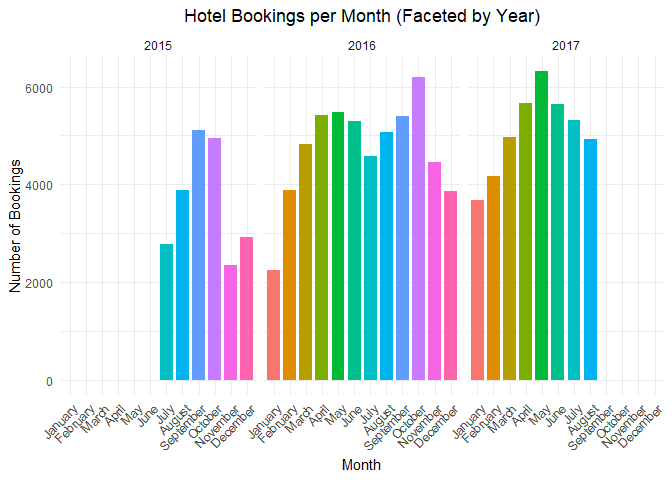
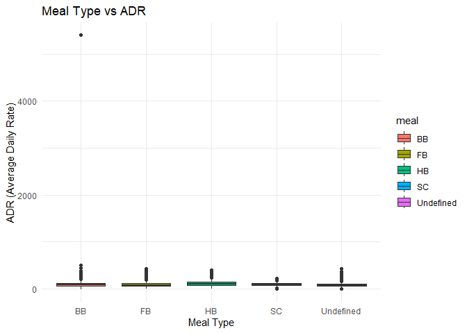
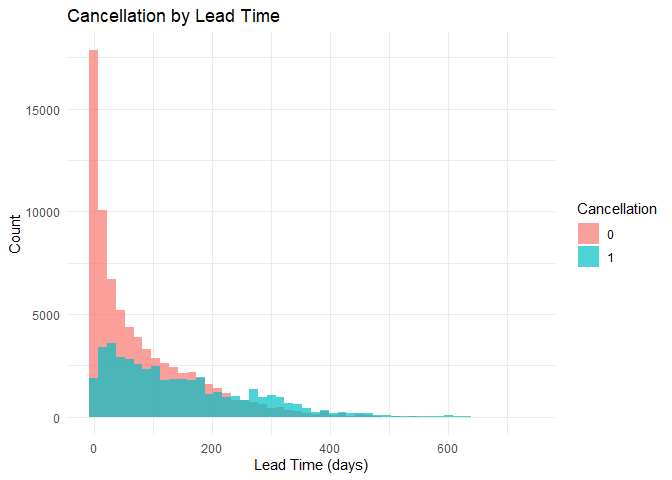

### Research topic: Hotel Booking Data

### Team members: Kaitlyn Hoyme and Christopher Moseley

### Introduction:

This report will demonstrate various relationships between variables
surrounding hotel booking data. We will examine these variables in order
to determine how they affect hotel bookings. This data would be of
interest to businesses like hotels, as they can adjust these factors to
improve profit and customer satisfaction.

### Data:

This dataset includes information on hotel booking data from two hotels
between the 1st of July 2015 and 31st of August 2017.  
There are 119390 rows of 36 variables.  
Variables are:  
- variablename : variabledescription

This dataset was found through Kaggle, the data is real. The data is
originally from “Hotel Booking Demand Datasets”, an article written by
Nuno Antonio, Ana Almeida, and Luis Nunes for Data in Brief, Volume 22,
February 2019.

``` r
library(dplyr)
library(ggplot2)
#Data: description of your data set, first data cleaning steps, marginal summaries;

url <- "https://raw.githubusercontent.com/khoy24/DS202FinalProject/main/hotel_booking.csv"
data <- read.csv(url)
colnames(data)
```

    ##  [1] "hotel"                          "is_canceled"                   
    ##  [3] "lead_time"                      "arrival_date_year"             
    ##  [5] "arrival_date_month"             "arrival_date_week_number"      
    ##  [7] "arrival_date_day_of_month"      "stays_in_weekend_nights"       
    ##  [9] "stays_in_week_nights"           "adults"                        
    ## [11] "children"                       "babies"                        
    ## [13] "meal"                           "country"                       
    ## [15] "market_segment"                 "distribution_channel"          
    ## [17] "is_repeated_guest"              "previous_cancellations"        
    ## [19] "previous_bookings_not_canceled" "reserved_room_type"            
    ## [21] "assigned_room_type"             "booking_changes"               
    ## [23] "deposit_type"                   "agent"                         
    ## [25] "company"                        "days_in_waiting_list"          
    ## [27] "customer_type"                  "adr"                           
    ## [29] "required_car_parking_spaces"    "total_of_special_requests"     
    ## [31] "reservation_status"             "reservation_status_date"       
    ## [33] "name"                           "email"                         
    ## [35] "phone.number"                   "credit_card"

``` r
nrow(data) # 119390 rows/entries
```

    ## [1] 119390

``` r
ncol(data) # 36 variables
```

    ## [1] 36

``` r
any(is.na(data))
```

    ## [1] TRUE

``` r
# no missing entries

duplicateRows <- data %>% filter(duplicated(.))
print(nrow(duplicateRows))
```

    ## [1] 0

``` r
#no duplicate rows


calculate_summary <- function(column) {
  c(
    mean = mean(column, na.rm = TRUE),
    median = median(column, na.rm = TRUE),
    sd = sd(column, na.rm = TRUE),
    min = min(column, na.rm = TRUE),
    max = max(column, na.rm = TRUE),
    range = diff(range(column, na.rm = TRUE))  # Range is the difference between max and min
  )
}

#will have to redo this for new dataset

#summary_stats <- data.frame(
#  age = calculate_summary(data$age),
#  income = calculate_summary(data$income),
#  purchase_amount = calculate_summary(data$purchase_amount)
#)

#print(summary_stats)
```

### Questions to be addressed:

- Question 1 ?  
- Question 2 ? ..

### Main - Curiosity

Intense exploration and evidence of many trials and failures. Presents
best ideas, rather than all ideas. Additional research from other
sources used to help understand/explain findings.

``` r
#practice plots

ggplot(data, aes(x = hotel, fill = factor(is_canceled))) +
  geom_bar(position = "fill") +
  labs(title = "Proportion of Cancellations by Hotel Type",
       x = "Hotel Type", y = "Proportion",
       fill = "Cancellation") +
  scale_y_continuous(labels = scales::percent) +
  theme_minimal()
```

<!-- -->

``` r
ggplot(data, aes(x = adults + children + babies, fill = factor(is_canceled))) +
  geom_bar(position = "fill") +
  labs(title = "Booking Size vs Cancellations",
       x = "Number of People (Adults + Children + Babies)", y = "Proportion",
       fill = "Cancellation") +
  scale_y_continuous(labels = scales::percent) +
  theme_minimal()
```

<!-- -->

``` r
ggplot(data, aes(x = is_repeated_guest, fill = factor(is_canceled))) +
  geom_bar(position = "fill") +
  labs(title = "Cancellation Rate Among Repeat Guests",
       x = "Repeat Guest", y = "Proportion",
       fill = "Cancellation") +
  scale_y_continuous(labels = scales::percent) +
  theme_minimal()
```

<!-- -->

``` r
ggplot(data, aes(x = meal, y = adr, fill = meal)) +
  geom_boxplot() +
  labs(title = "Meal Type vs ADR",
       x = "Meal Type", y = "ADR (Average Daily Rate)") +
  theme_minimal()
```

<!-- -->

``` r
ggplot(data, aes(x = lead_time, fill = factor(is_canceled))) +
  geom_histogram(bins = 50, alpha = 0.7, position = "identity") +
  labs(title = "Cancellation by Lead Time",
       x = "Lead Time (days)", y = "Count",
       fill = "Cancellation") +
  theme_minimal()
```

<!-- -->

``` r
max(data$adults)
```

    ## [1] 55

``` r
max(data$babies)
```

    ## [1] 10

``` r
max(data$children)
```

    ## [1] NA
