### Research topic: Hotel Booking Data

### Team members: Kaitlyn Hoyme and Christopher Moseley

### Introduction:

This report will demonstrate various relationships between variables
surrounding hotel booking data. We will examine these variables in order
to determine how they affect each other and hotel bookings. This data
would be of interest to businesses like hotels, as they can adjust these
factors to improve their profit and customer satisfaction.

### Questions we will address:

- How does the time of year affect hotel bookings?  
- What makes guests more likely to cancel their bookings?  
- How does the average daily rate affect bookings?  
- How does number of guests affect hotel bookings?  
- What affects how many times bookings are changed?  
- Where are most visitors coming from?

By investigating these questions we hope to demonstrate useful data
about what factors affect hotel bookings.

### Data:

This dataset includes information on hotel booking data from two hotels,
one a city hotel, the other a resort hotel, with data collected between
the 1st of July 2015 and 31st of August 2017.

There are 119390 rows of 36 variables.  
The Variables are:  
- hotel : States what hotel the row represents data from. City Hotel or
Resort Hotel.  
- is_canceled : value that indicates if the booking was canceled (1) or
not (0).  
- lead_time : Number of days that occurred between the entering date of
the booking into the PMS and the arrival date.  
- arrival_date_year : The year of the arrival date (values are between
2015-2017).  
- arrival_date_month : Month of arrival date. Categorical variable with
values “January” through “December”.  
- arrival_date_week_number : Week number of the arrival date.  
- arrival_date_day_of_month : Day of the month of the arrival date.  
- stays_in_weekend_nights : Number of weekend nights (Saturday or
Sunday) the guest stayed or booked to stay at the hotel.  
- stays_in_week_nights : Number of week nights (Monday-Friday) the guest
stayed or booked to stay at the hotel.  
- adults : Number of adults.  
- children : Number of children.  
- babies : Number of babies.  
- meal : Represents the type of meals offered by the hotel. Ex: BB = Bed
& Breakfast.  
- country : Country of origin.  
- market_segment : Market segment designation. In categories
(categorical). “TA” means travel agents, and “TO” means tour operators  
- distribution_channel : Booking distribution channel. The term “TA”
means travel agents, and “TO” means tour operators.  
- is_repeated_guest : Value indicating if the booking name was from a
repeated guest (1) or not (0).  
- previous_cancellations : Number of previous bookings that were
cancelled by the customer prior to the current booking.  
- previous_bookings_not_canceled : Number of previous bookings not
cancelled by the customer prior to the current booking.  
- reserved_room_type : Code of room type reserved.  
- assigned_room_type : Code for type of room assigned to the booking.
Sometimes the assigned room type differs from the reserved room type due
to hotel operation reasons (eg overbooking) or by customer request.  
- booking_changes : Number of changes/amendments made to the booking
from the moment the booking was entered on the PMS until the moment of
check-in or cancellation.  
- deposit_type : Represents deposit type. No Deposit - no deposit was
made; Non Refund - a deposit was made in the value of the total stay
cost; Refundable - a deposit was made with a value under the total cost
of stay.  
- agent : ID of the travel agency that made the booking.  
- company : ID of the company/entity that made the booking or
responsible for paying the booking. ID is presented instead of
designation for anonymity reasons.  
- days_in_waiting_list : Number of days the booking was in the waiting
list before it was confirmed to the customer.  
- customer_type : Group - when the booking is associated to a group;
Transient - when the booking is not part of a group or contract and is
not associated to other transient booking; Transient-party - when the
booking is transient but is associated to at least one other transient
booking.  
- adr : Average daily rate calculated by dividing the sum of all lodging
transactions by the total number of staying nights.  
- required_car_parking_spaces : Number of parking spaces required by the
customer.  
- total_of_special_requests : Number of special requests made by the
customer (e.g. twin bed or high floor).  
- reservation_status : Check-Out - customer has checked in but already
departed; No-Show - customer did not check-in and did inform the hotel
of the reason why, etc..  
- reservation_status_date : Date at which the last status was set. This
variable can be used in conjunction with the ReservationStatus to
understand when the booking was canceled or when the customer check-out
of the hotel.  
- name : Name of the guest (not real for anonymity).  
- email : Email of the guest (not real for anonymity).  
- phone-number : Phone number of the guest (not real for anonymity).  
- credit_card : Credit Card Number of the guest (not real for
anonymity).

This dataset was found through Kaggle and all of the data recorded is
real. However, for reasons surrounding anonymity variables like name,
email, phone-number, and credit card are all made up. The data was
originally obtained from “Hotel Booking Demand Datasets”, an article
written by Nuno Antonio, Ana Almeida, and Luis Nunes for Data in Brief,
Volume 22, February 2019.  
This is a link to our dataset on Kaggle:
<https://www.kaggle.com/datasets/mojtaba142/hotel-booking/data>

### Data Cleaning

``` r
library(dplyr)
library(ggplot2)
library(scales)
#Data: description of your data set, first data cleaning steps, marginal summaries;

url <- "https://raw.githubusercontent.com/khoy24/DS202FinalProject/main/hotel_booking.csv"
data <- read.csv(url)
colnames(data)
```

    ##  [1] "hotel"                          "is_canceled"                   
    ##  [3] "lead_time"                      "arrival_date_year"             
    ##  [5] "arrival_date_month"             "arrival_date_week_number"      
    ##  [7] "arrival_date_day_of_month"      "stays_in_weekend_nights"       
    ##  [9] "stays_in_week_nights"           "adults"                        
    ## [11] "children"                       "babies"                        
    ## [13] "meal"                           "country"                       
    ## [15] "market_segment"                 "distribution_channel"          
    ## [17] "is_repeated_guest"              "previous_cancellations"        
    ## [19] "previous_bookings_not_canceled" "reserved_room_type"            
    ## [21] "assigned_room_type"             "booking_changes"               
    ## [23] "deposit_type"                   "agent"                         
    ## [25] "company"                        "days_in_waiting_list"          
    ## [27] "customer_type"                  "adr"                           
    ## [29] "required_car_parking_spaces"    "total_of_special_requests"     
    ## [31] "reservation_status"             "reservation_status_date"       
    ## [33] "name"                           "email"                         
    ## [35] "phone.number"                   "credit_card"

``` r
#nrow(data) # 119390 rows/entries
#ncol(data) # 36 variables

# any(is.na(data))
# a few missing entries
#colSums(is.na(data))
#only missing columns were in agent and company which makes sense so we decided to leave that. There are also
#4 NA values in the children column which we will leave. 

duplicateRows <- data %>% filter(duplicated(.))
# print(nrow(duplicateRows))
# no duplicate rows in this dataset

#examine types of columns, make sure makes sense
str(data)
```

    ## 'data.frame':    119390 obs. of  36 variables:
    ##  $ hotel                         : chr  "Resort Hotel" "Resort Hotel" "Resort Hotel" "Resort Hotel" ...
    ##  $ is_canceled                   : int  0 0 0 0 0 0 0 0 1 1 ...
    ##  $ lead_time                     : int  342 737 7 13 14 14 0 9 85 75 ...
    ##  $ arrival_date_year             : int  2015 2015 2015 2015 2015 2015 2015 2015 2015 2015 ...
    ##  $ arrival_date_month            : chr  "July" "July" "July" "July" ...
    ##  $ arrival_date_week_number      : int  27 27 27 27 27 27 27 27 27 27 ...
    ##  $ arrival_date_day_of_month     : int  1 1 1 1 1 1 1 1 1 1 ...
    ##  $ stays_in_weekend_nights       : int  0 0 0 0 0 0 0 0 0 0 ...
    ##  $ stays_in_week_nights          : int  0 0 1 1 2 2 2 2 3 3 ...
    ##  $ adults                        : int  2 2 1 1 2 2 2 2 2 2 ...
    ##  $ children                      : num  0 0 0 0 0 0 0 0 0 0 ...
    ##  $ babies                        : int  0 0 0 0 0 0 0 0 0 0 ...
    ##  $ meal                          : chr  "BB" "BB" "BB" "BB" ...
    ##  $ country                       : chr  "PRT" "PRT" "GBR" "GBR" ...
    ##  $ market_segment                : chr  "Direct" "Direct" "Direct" "Corporate" ...
    ##  $ distribution_channel          : chr  "Direct" "Direct" "Direct" "Corporate" ...
    ##  $ is_repeated_guest             : int  0 0 0 0 0 0 0 0 0 0 ...
    ##  $ previous_cancellations        : int  0 0 0 0 0 0 0 0 0 0 ...
    ##  $ previous_bookings_not_canceled: int  0 0 0 0 0 0 0 0 0 0 ...
    ##  $ reserved_room_type            : chr  "C" "C" "A" "A" ...
    ##  $ assigned_room_type            : chr  "C" "C" "C" "A" ...
    ##  $ booking_changes               : int  3 4 0 0 0 0 0 0 0 0 ...
    ##  $ deposit_type                  : chr  "No Deposit" "No Deposit" "No Deposit" "No Deposit" ...
    ##  $ agent                         : num  NA NA NA 304 240 240 NA 303 240 15 ...
    ##  $ company                       : num  NA NA NA NA NA NA NA NA NA NA ...
    ##  $ days_in_waiting_list          : int  0 0 0 0 0 0 0 0 0 0 ...
    ##  $ customer_type                 : chr  "Transient" "Transient" "Transient" "Transient" ...
    ##  $ adr                           : num  0 0 75 75 98 ...
    ##  $ required_car_parking_spaces   : int  0 0 0 0 0 0 0 0 0 0 ...
    ##  $ total_of_special_requests     : int  0 0 0 0 1 1 0 1 1 0 ...
    ##  $ reservation_status            : chr  "Check-Out" "Check-Out" "Check-Out" "Check-Out" ...
    ##  $ reservation_status_date       : chr  "2015-07-01" "2015-07-01" "2015-07-02" "2015-07-02" ...
    ##  $ name                          : chr  "Ernest Barnes" "Andrea Baker" "Rebecca Parker" "Laura Murray" ...
    ##  $ email                         : chr  "Ernest.Barnes31@outlook.com" "Andrea_Baker94@aol.com" "Rebecca_Parker@comcast.net" "Laura_M@gmail.com" ...
    ##  $ phone.number                  : chr  "669-792-1661" "858-637-6955" "652-885-2745" "364-656-8427" ...
    ##  $ credit_card                   : chr  "************4322" "************9157" "************3734" "************5677" ...

``` r
#Change variable types to be correct
#Need to make year not be an int. Change that and the similar values to strings.
data <- data %>%
  mutate(
    `arrival_date_year` = as.character(`arrival_date_year`),
    `arrival_date_week_number` = as.character(`arrival_date_week_number`),
    `arrival_date_day_of_month` = as.character(`arrival_date_day_of_month`),
    `is_repeated_guest` = as.character(`is_repeated_guest`)
  )
```

### Results

### Main - Curiosity

Intense exploration and evidence of many trials and failures. Presents
best ideas, rather than all ideas. Additional research from other
sources used to help understand/explain findings.

### How does the time of year affect hotel bookings?

``` r
#Have to make months a factor to reorder in order of correct months
data$arrival_date_month <- factor(data$arrival_date_month, levels = c("January", "February", "March", "April", "May", "June", "July", "August", "September", "October", "November", "December"))

# We also only have data for half the year of 2015, and 8 months of 2017. 2016 was the only full year we had. This is why we represent it by months, not years. 

#We separate hotel bookings per month and facet that by year, as we'd have more months for those included on the half years. 

#color code the months by temperature 
monthcolors <- c(
  "January" = "#4575b4",  
  "February" = "#74add1",  
  "March" = "#abd9e9",
  "April" = "#e0f3f8",
  "May" = "#fee090",
  "June" = "#fdae61",
  "July" = "#f46d43",     
  "August" = "#d73027",   
  "September" = "#fdae61",
  "October" = "#fee090",
  "November" = "#abd9e9",
  "December" = "#74add1"
)

ggplot(data, aes(x = arrival_date_month, fill = arrival_date_month)) +
  geom_bar(width = 0.8) + 
  labs(title = "Hotel Bookings per Month", 
       x = "Month", y = "Number of Bookings") +
  facet_wrap(~ arrival_date_year) +
  scale_fill_manual(values = monthcolors) +
  theme_minimal() +
  theme(
    axis.text.x = element_text(angle = 45, hjust = 1, vjust = 1),
    plot.title = element_text(hjust = 0.5),
    legend.position = "none"
  )
```

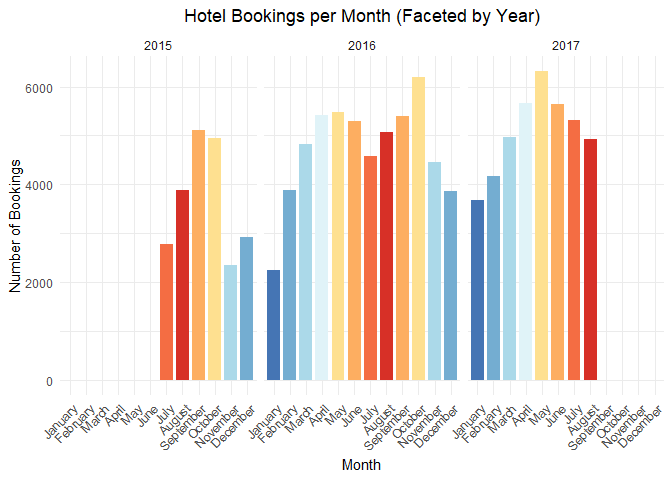<!-- -->

This plot shows the number of hotel bookings per month (it shows the
number of bookings made FOR that month, not what month the booking was
made).

Now we see that in 2015 the months with the most bookings were
September-October, in 2016 it was October again, followed by the spring
and summer months, and in 2017 it was May with the highest number of
bookings, with its surrounding months following it. For the most part we
still see that months with warmer. more mild weather, like the spring
and fall seasons have more bookings.

Now we observe how how the month affects the bookings separately for the
resort and city hotels.

``` r
ggplot(data, aes(x = arrival_date_month, fill = hotel)) +
  geom_bar(position = "dodge") +
  facet_wrap(~ arrival_date_year) +
  labs(title = "Monthly Bookings: Resort vs City Hotel", x = "Month", y = "Bookings") +
  theme_minimal() +
  theme(axis.text.x = element_text(angle = 45, hjust = 1),
        plot.title = element_text(hjust = 0.5))
```

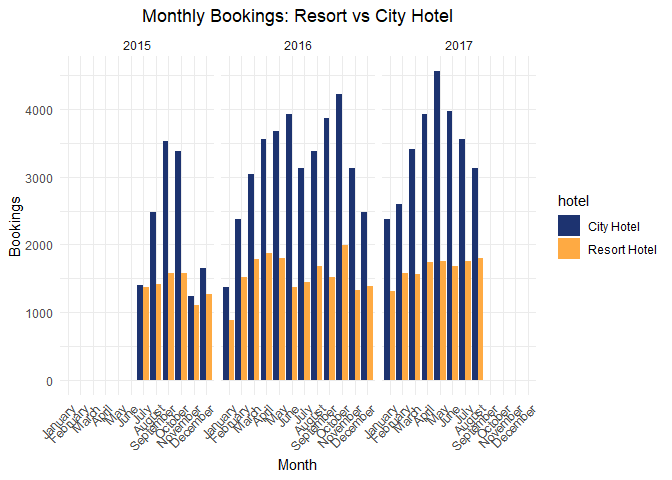<!-- -->

As you can see, for the most part the two hotels follow relatively the
same trend with the months with a few exceptions. We also notice that
the city hotel has a lot more bookings in comparison to the resort
hotel. The city hotel also has more variation in the number of bookings,
while the resort hotels number of bookings seems more consistent.

The following graph shows numbers of bookings by month and year in
heatmap form.

``` r
heatmap_data <- data %>%
  group_by(arrival_date_year, arrival_date_month) %>%
  summarise(bookings = n())

ggplot(heatmap_data, aes(x = arrival_date_month, y = arrival_date_year, fill = bookings)) +
  geom_tile(color = "white") +
  scale_fill_gradient(low = "#e0f3f8", high = "#d73027") +
  labs(title = "Heatmap of Bookings by Month and Year",
       x = "Month", y = "Year", fill = "Bookings") +
  theme_minimal() +
  theme(axis.text.x = element_text(angle = 45, hjust = 1),
        plot.title = element_text(hjust = 0.5))
```

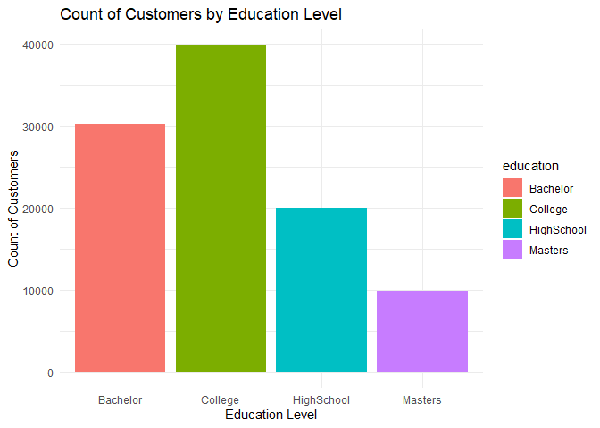<!-- -->

As you can see in this graph, we can see that the bookings in generally
have been increasing slightly over the years, and that they are
generally higher in the spring and the fall.

The following graph shows bookings cancelled vs bookings not cancelled
by month and facetted by year.

``` r
# set up data to compare with cancelled or not
cancellation_summary <- data %>%
  group_by(arrival_date_year, arrival_date_month, is_canceled) %>%
  summarise(bookings = n(), .groups = 'drop')

# add key
cancellation_summary$is_canceled <- factor(cancellation_summary$is_canceled,
                                           labels = c("Not Canceled", "Canceled"))

# Plot
ggplot(cancellation_summary, aes(x = arrival_date_month, y = bookings, fill = is_canceled)) +
  geom_bar(stat = "identity", position = "stack") +
  facet_wrap(~ arrival_date_year) +
  labs(title = "Hotel Booking Cancellations by Month and Year",
       x = "Arrival Month", y = "Number of Bookings", fill = "Status") +
  theme_minimal() +
  theme(axis.text.x = element_text(angle = 45, hjust = 1),
        plot.title = element_text(hjust = 0.5))
```

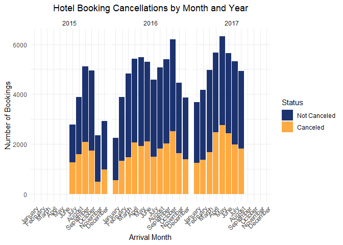<!-- -->

Looking at the chart the number of cancellations seems to follow the
number of bookings. There doesn’t seem to be any super significant
months or years where cancellations are more frequent in comparison to
the number of bookings for that month.

Now we want to observe if the month/year affects the duration of a
guest’s stay.

``` r
#add variables for length of stay and total number of guests for later calculations
data <- data %>%
  mutate(
    length_of_stay = stays_in_weekend_nights + stays_in_week_nights,
  )


avg_stay_per_booking <- data %>%
  group_by(arrival_date_year, arrival_date_month) %>%
  summarise(
    avg_stay = mean(length_of_stay, na.rm = TRUE),
    .groups = 'drop'
  )


ggplot(avg_stay_per_booking, aes(x = arrival_date_month, y = avg_stay, fill = arrival_date_month)) +
  geom_bar(stat = "identity") +
  facet_wrap(~arrival_date_year) +
  labs(title = "Average Length of Stay per Booking",
       x = "Month", y = "Average Length of Stay") +
  scale_fill_manual(values = monthcolors) +
  theme_minimal() +
  theme(
    axis.text.x = element_text(angle = 45, hjust = 1),
    plot.title = element_text(hjust = 0.5),
    legend.position = "none"
  )
```

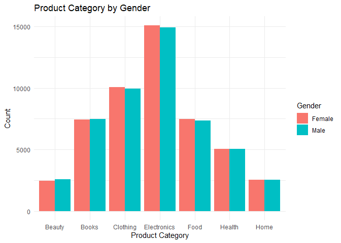<!-- -->

This graph shows the average length of stay for each booking. We
calculate total nights stayed by adding weekend nights and week nights
together. It demonstrates that the average length of stay for a booking
is longer in summer months / hotter weather with it being around 3-4
nights, with the colder months being more around 2-3 nights on average.

### What makes guests more likely to cancel their bookings?

We will examine the following variables for how they affect
cancellations:  
- lead_time  
- previous_cancellations  
- customer_type  
- market_segment  
- hotel  
- special_requests

The following graph shows cancellation by lead time.

``` r
ggplot(data, aes(x = lead_time, fill = factor(is_canceled))) +
  geom_histogram(position = "fill", bins = 50) +
  labs(title = "Cancellation Rate by Lead Time", x = "Lead Time (days)",
       y = "Proportion", fill = "Canceled") +
  theme_minimal() + 
  theme(
    plot.title = element_text(hjust = 0.5)
  )
```

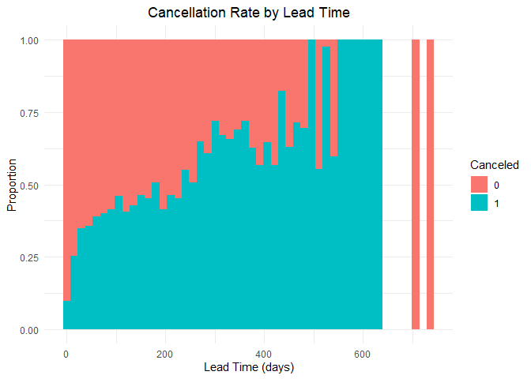<!-- -->

Apart from the two outliers on the far right of the graph that did not
cancel their bookings, the trend seems to be that the longer the lead
time the higher the chance of cancellation.

The following graph demonstrates how previous_cancellations affects the
chance of cancelling again.

``` r
data %>%
  group_by(previous_cancellations) %>%
  summarise(
    count = n(),
    cancel_rate = mean(is_canceled),
    .groups = "drop"
  ) %>%
  filter(count > 20) %>%  # ignore values with less data entries
  ggplot(aes(x = as.factor(previous_cancellations), y = cancel_rate)) +
  geom_bar(stat = "identity") +
  geom_text(aes(label = scales::percent(cancel_rate, accuracy = 0.1)), 
            vjust = -0.5, size = 4) +
  scale_y_continuous(labels = scales::percent_format()) +
  labs(
    title = "Cancellation Rate by Number of Previous Cancellations",
    x = "Number of Previous Cancellations",
    y = "Cancellation Rate"
  ) +
  theme_minimal() + 
  theme(
    plot.title = element_text(hjust = 0.5)
  )
```

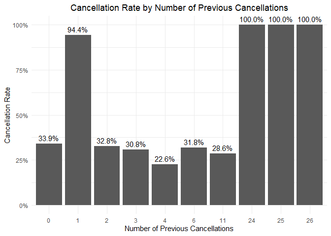<!-- -->

For example, 94.4% of customers that have previously cancelled once will
cancel again on another booking. This graph shows that the rate of
cancellation is generally lower for guests that have previously stayed
there and didn’t cancel at least once.

Here we examine whether the fact that a guest is a returning guest or
not affects the cancellation rate.

``` r
ggplot(data, aes(x = factor(is_repeated_guest), y = is_canceled, fill = is_repeated_guest)) +
  stat_summary(fun = mean, geom = "bar", width = 0.6) +
  scale_x_discrete(labels = c("New Guest", "Returning Guest")) +
  scale_y_continuous(labels = scales::percent_format(accuracy = 1)) +
  labs(
    title = "Cancellation Rate by Returning Guest Status",
    x = "Guest Type",
    y = "Cancellation Rate"
  ) +
  theme_minimal() +
  theme(
    plot.title = element_text(hjust = 0.5)
  )
```

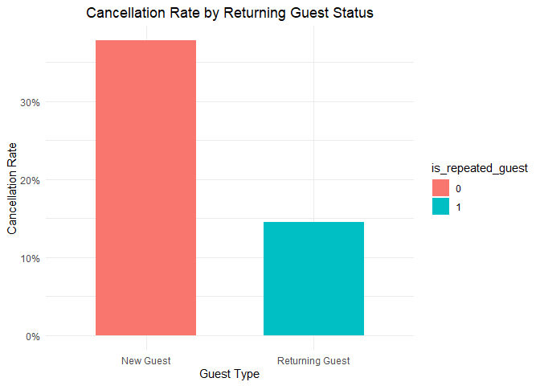<!-- -->

As we can see, it seems as if new guests are more likely to cancel their
bookings than a returning guest. This could be because returning guests
know what they’re getting when they book the hotel since they have
booked it before and if they were returning knew they were going to be
satisfied. It could also have something to do with guests returning
frequently for things such as business trips, which then they will be
more frequent and consistent customers.

The graph shows the relationships from customer type to cancellations.

``` r
data %>%
  group_by(customer_type) %>%
  summarise(
    total_bookings = n(),
    cancel_rate = mean(is_canceled),
    .groups = "drop"
  ) %>%
  mutate(customer_type = reorder(customer_type, cancel_rate)) %>%  # reorder levels
  ggplot(aes(x = customer_type, y = cancel_rate, fill = customer_type)) +
  geom_bar(stat = "identity") +
  geom_text(aes(label = percent(cancel_rate, accuracy = 0.1)), 
            vjust = -0.5, size = 4) +
  scale_y_continuous(labels = percent_format()) +
  labs(
    title = "Cancellation Rate by Customer Type (Ordered Low to High)",
    x = "Customer Type",
    y = "Cancellation Rate"
  ) +
  theme_minimal() +
  theme(legend.position = "none",
    plot.title = element_text(hjust = 0.5)
  )
```

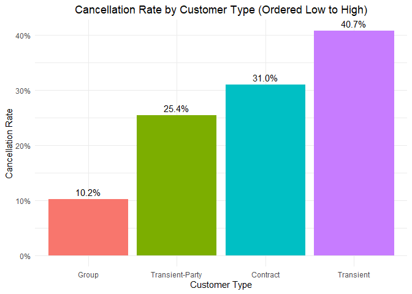<!-- -->

This graph demonstrates the cancellation rates for various customer
types. As we can see, transient customers have the highest cancellation
rates with 40.7% cancellation rate. Group customers have the lowest with
a 10.2% cancellation rate.

This graph demonstrates the relationship between market segments and
cancellation rates.

``` r
data %>%
  filter(market_segment != "Undefined") %>%
  group_by(market_segment) %>%
  summarise(
    total_bookings = n(),
    cancel_rate = mean(is_canceled),
    .groups = "drop"
  ) %>%
  ggplot(aes(x = reorder(market_segment, -cancel_rate), y = cancel_rate, fill = market_segment)) +
  geom_bar(stat = "identity") +
  geom_text(aes(label = percent(cancel_rate, accuracy = 0.1)),
            vjust = -0.5, size = 4) +
  scale_y_continuous(labels = percent_format()) +
  labs(
    title = "Cancellation Rate by Market Segment",
    x = "Market Segment",
    y = "Cancellation Rate"
  ) +
  theme_minimal() +
  theme(legend.position = "none",
    plot.title = element_text(hjust = 0.5)
  )
```

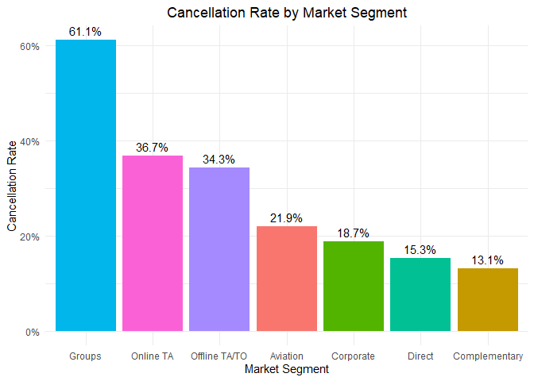<!-- -->

This graph shows the cancellation rate by market segment. As you can
see, the Groups category for market segment has the highest cancellation
rate with 61.1%, and complementary has the lowest with 13.1%.

This next graph shows the cancellation rates in the different hotels
(resort vs city).

``` r
data %>%
  group_by(hotel) %>%
  summarise(
    total_bookings = n(),
    cancel_rate = mean(is_canceled),
    .groups = "drop"
  ) %>%
  ggplot(aes(x = hotel, y = cancel_rate, fill = hotel)) +
  geom_bar(stat = "identity") +
  geom_text(aes(label = percent(cancel_rate, accuracy = 0.1)),
            vjust = -0.5, size = 4) +
  scale_y_continuous(labels = percent_format()) +
  labs(
    title = "Cancellation Rate by Hotel Type",
    x = "Hotel Type",
    y = "Cancellation Rate"
  ) +
  theme_minimal() +
  theme(legend.position = "none",
    plot.title = element_text(hjust = 0.5)
    )
```

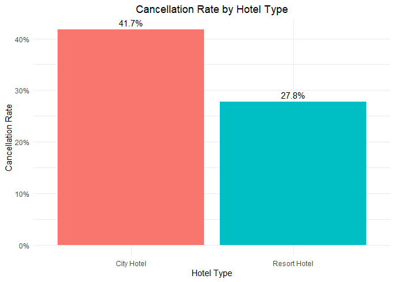<!-- -->

As shown in the graph, the city hotel has a higher cancellation rate of
about 41.7% whereas the resort hotel had 27.8% cancellation rate.

This graph shows how the number of special requests correlates with the
cancellation rate.

``` r
data %>%
  group_by(total_of_special_requests) %>%
  summarise(
    count = n(),
    cancel_rate = mean(is_canceled),
    .groups = "drop"
  ) %>%
  filter(count > 30) %>%  # Optional: remove rare categories for clarity
  ggplot(aes(x = as.factor(total_of_special_requests), y = cancel_rate)) +
  geom_bar(stat = "identity") +
  geom_text(aes(label = percent(cancel_rate, accuracy = 0.1)), 
            vjust = -0.5, size = 4) +
  scale_y_continuous(labels = percent_format()) +
  labs(
    title = "Cancellation Rate by Number of Special Requests",
    x = "Number of Special Requests",
    y = "Cancellation Rate"
  ) +
  theme_minimal() + 
  theme(
    plot.title = element_text(hjust = 0.5)
  )
```

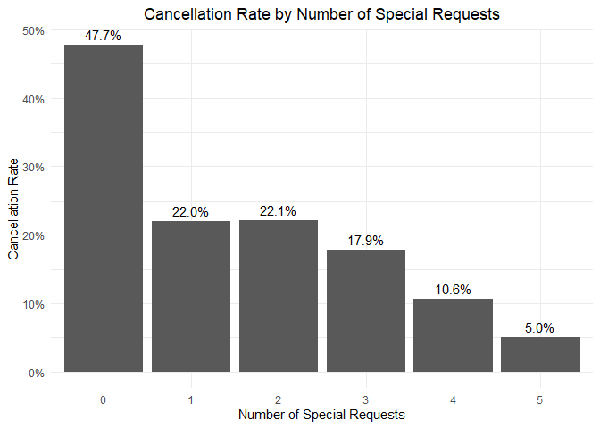<!-- -->

This graph shows that as the number of special requests made gets
higher, the rate of cancellation becomes lower.

### How does the average daily rate affect bookings?

``` r
# Load required libraries
library(dplyr)
library(ggplot2)
library(tidyr)
library(scales)

# Convert arrival_date_month to ordered factor for correct month sorting
data$arrival_date_month <- factor(data$arrival_date_month, 
                                   levels = c("January", "February", "March", "April", "May", "June", 
                                              "July", "August", "September", "October", "November", "December"))

# 1. ADR and Bookings by Month and Year
monthly_adr <- data %>%
  group_by(arrival_date_year, arrival_date_month) %>%
  summarise(avg_adr = mean(adr, na.rm = TRUE),
            total_bookings = n(),
            cancellations = sum(is_canceled)) %>%
  ungroup()

# 3. ADR vs. Booking Frequency (binned)
data %>%
  filter(adr > 0 & adr < 500) %>%
  mutate(adr_bin = cut(adr, breaks = seq(0, 500, by = 25))) %>%
  group_by(adr_bin) %>%
  summarise(bookings = n()) %>%
  ggplot(aes(x = adr_bin, y = bookings)) +
  geom_bar(stat = "identity", fill = "#1f77b4") +
  labs(title = "Bookings by ADR Range", x = "ADR Bin", y = "Number of Bookings") +
  theme(axis.text.x = element_text(angle = 45, hjust = 1))
```

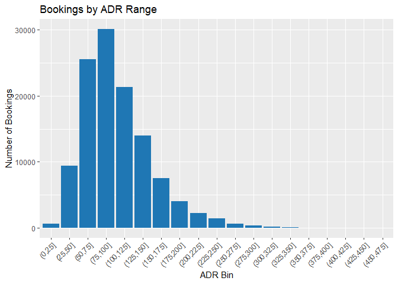<!-- -->

``` r
# 4. ADR by Month
monthly_adr_data <- data %>%
  group_by(arrival_date_month) %>%
  summarise(avg_adr = mean(adr, na.rm = TRUE), bookings = n())

# Calculate average bookings by month, considering different years
monthly_bookings <- data %>%
  group_by(arrival_date_month, arrival_date_year) %>%
  summarise(monthly_bookings = n()) %>%
  ungroup()

# Calculate the average number of bookings for each month across all years
monthly_avg_bookings <- monthly_bookings %>%
  group_by(arrival_date_month) %>%
  summarise(avg_bookings = mean(monthly_bookings, na.rm = TRUE)) %>%
  arrange(factor(arrival_date_month, levels = c("January", "February", "March", "April", "May", "June", 
                                                "July", "August", "September", "October", "November", "December")))

# Monthly comparison: avg_adr and avg_bookings by month and year
monthly_comparison <- data %>%
  group_by(arrival_date_year, arrival_date_month) %>%
  summarise(
    avg_adr = mean(adr, na.rm = TRUE),
    avg_bookings = n()
  ) %>%
  ungroup()

# Normalize values per year
monthly_comparison <- monthly_comparison %>%
  group_by(arrival_date_year) %>%
  mutate(
    normalized_bookings = rescale(avg_bookings),
    normalized_adr = rescale(avg_adr)
  ) %>%
  ungroup()

# Reshape to long format and rename metrics for clarity
monthly_comparison_long <- monthly_comparison %>%
  pivot_longer(cols = c(normalized_bookings, normalized_adr),
               names_to = "metric", values_to = "value") %>%
  mutate(metric = recode(metric,
                         normalized_bookings = "Bookings",
                         normalized_adr = "ADR"))


cleaned_data <- data %>%
  filter(!is.na(adr), !is.na(lead_time), adr <= 1000)

ggplot(cleaned_data, aes(x = lead_time, y = adr)) +
  geom_point(alpha = 0.5) +  # Scatter plot with transparency for better visibility
  labs(title = "Relationship Between Lead Time and Average Daily Rate (ADR)",
       x = "Lead Time (Days)",
       y = "Average Daily Rate (ADR)") +
  theme_minimal()
```

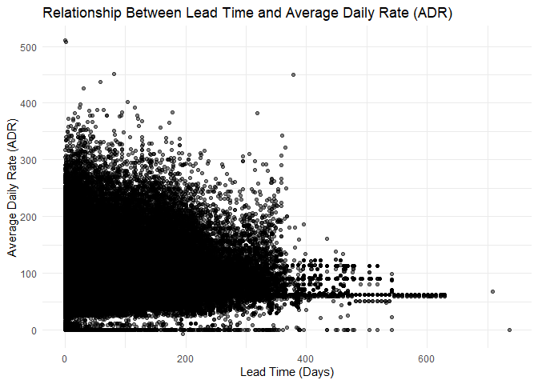<!-- -->

``` r
# Create labeled datasets
monthly_avg_bookings$metric <- "Average Bookings"
monthly_avg_bookings$value <- monthly_avg_bookings$avg_bookings

monthly_adr_data$metric <- "Average ADR"
monthly_adr_data$value <- monthly_adr_data$avg_adr

# Combine into one data frame
combined_monthly_data <- rbind(
  monthly_avg_bookings[, c("arrival_date_month", "metric", "value")],
  monthly_adr_data[, c("arrival_date_month", "metric", "value")]
)

# Set month order
combined_monthly_data$arrival_date_month <- factor(
  combined_monthly_data$arrival_date_month,
  levels = levels(data$arrival_date_month)
)

ggplot(combined_monthly_data, aes(x = arrival_date_month, y = value, fill = metric)) +
  geom_bar(stat = "identity", show.legend = FALSE) +
  scale_fill_manual(values = c("Average Bookings" = "#1f77b4", "Average ADR" = "#ff7f0e")) +
  facet_wrap(~metric, scales = "free_y") +  # Side-by-side
  labs(title = "Monthly Comparison of Average Bookings and ADR",
       x = "Month", y = "Value") +
  theme(axis.text.x = element_text(angle = 45, hjust = 1))
```

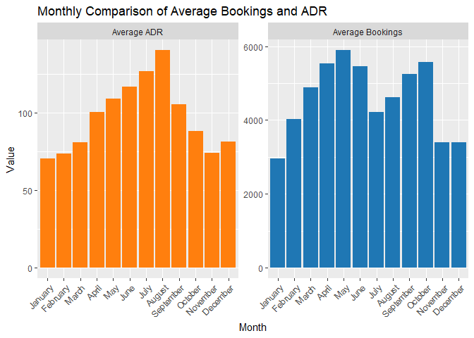<!-- -->

``` r
#data <- data %>%
 # mutate(total_guests = adults + children + babies)

filtered_data <- data %>%
  mutate(total_guests = adults + children + babies) %>%
  filter(adr <= 1000, total_guests > 0, total_guests < 20)


ggplot(filtered_data, aes(x = total_guests, y = adr)) +
  geom_jitter(alpha = 0.4, color = "#2c7fb8") +
  geom_smooth(method = "lm", se = FALSE, color = "darkorange") +
  labs(title = "ADR vs. Number of Guests",
       x = "Total Number of Guests",
       y = "Average Daily Rate (ADR)") +
  theme_minimal()
```

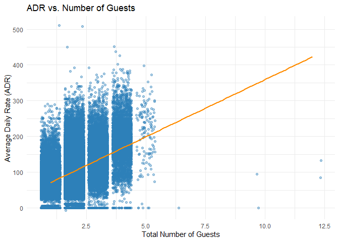<!-- -->

``` r
# Create a new column indicating presence of an agent
data <- data %>%
  mutate(has_agent = ifelse(is.na(agent), "No Agent", "Has Agent"))

# Filter for ADR values below 1000
filtered_data <- data %>%
  filter(adr < 1000)

# Box plot of ADR by agent status
ggplot(filtered_data, aes(x = has_agent, y = adr, fill = has_agent)) +
  geom_boxplot(outlier.alpha = 0.2) +
  labs(
    title = "ADR Comparison (ADR < 1000): Bookings With vs Without Agent",
    x = "Agent Status",
    y = "Average Daily Rate (ADR)"
  ) +
  scale_fill_manual(values = c("Has Agent" = "#1f77b4", "No Agent" = "#ff7f0e")) +
  theme_minimal() +
  theme(legend.position = "none")
```

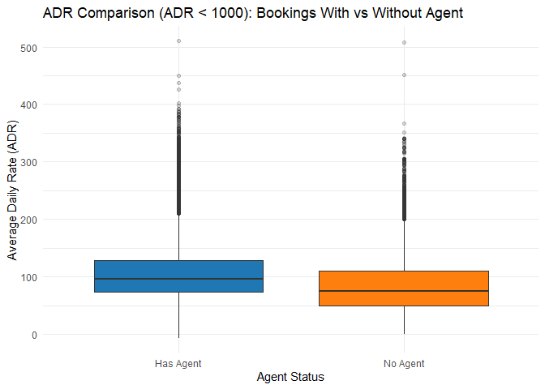<!-- -->

### What affects how many times bookings are changed?

``` r
data %>%
  count(booking_changes) %>%
  filter(n > 50) %>%  # Filter out rare counts for clarity
  ggplot(aes(x = as.factor(booking_changes), y = n)) +
  geom_bar(stat = "identity", fill = "#3182bd") +
  labs(
    title = "Distribution of Booking Changes",
    x = "Number of Changes",
    y = "Number of Bookings"
  ) +
  theme_minimal() + 
  theme(
    plot.title = element_text(hjust = 0.5)
  )
```

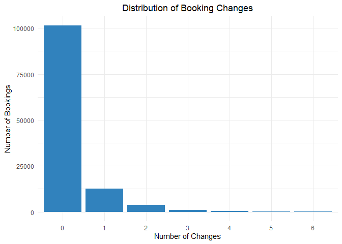<!-- -->

This chart shows the distribution of how many booking changes are made.
As you can see, the majority of bookings don’t have any changes made to
them, and it drops from there.

This is the cancellation rate by number of bookings.

``` r
data %>%
  group_by(booking_changes) %>%
  summarise(
    total = n(),
    cancel_rate = mean(is_canceled),
    .groups = "drop"
  ) %>%
  filter(total > 50) %>%
  ggplot(aes(x = as.factor(booking_changes), y = cancel_rate)) +
  geom_bar(stat = "identity", fill = "#de2d26") +
  geom_text(aes(label = scales::percent(cancel_rate, accuracy = 0.1)), 
            vjust = -0.5, size = 4) +
  scale_y_continuous(labels = scales::percent_format()) +
  labs(
    title = "Cancellation Rate by Number of Booking Changes",
    x = "Number of Changes",
    y = "Cancellation Rate"
  ) +
  theme_minimal() + 
  theme(
    plot.title = element_text(hjust = 0.5)
  )
```

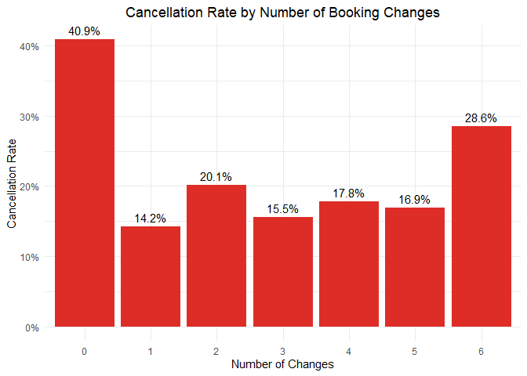<!-- -->

This shows cancellation rate by number of changes.

This shows booking changes by hotel type.

``` r
data %>%
  group_by(hotel, booking_changes) %>%
  summarise(n = n(), .groups = "drop") %>%
  group_by(hotel) %>%
  mutate(proportion = n / sum(n)) %>%
  filter(n > 50) %>%  # Optional: filter out rare booking change values
  ggplot(aes(x = as.factor(booking_changes), y = proportion, fill = hotel)) +
  geom_bar(stat = "identity", position = position_dodge(width = 0.8), width = 0.7) +
  scale_y_continuous(labels = percent_format()) +
  labs(
    title = "Proportion of Booking Changes by Hotel Type",
    x = "Number of Booking Changes",
    y = "Proportion of Bookings",
    fill = "Hotel Type"
  ) +
  theme_minimal() + 
  theme(
    plot.title = element_text(hjust = 0.5)
  )
```

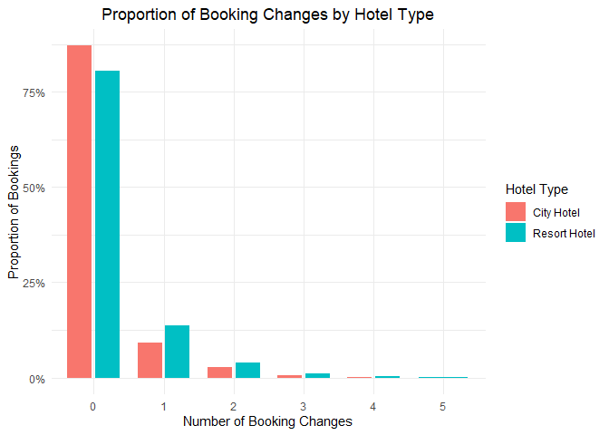<!-- -->

As we can see the hotel type doesn’t seem to affect the number of
booking changes very much. There is no significant data to be shown
other than that they don’t seem to be very correlated.

How does lead time correlate to booking changes? We hypothesize the
longer lead time is the more booking changes will be made.

``` r
data %>%
  mutate(lead_time_bin = cut(lead_time, breaks = 20)) %>%  # bin
  group_by(lead_time_bin) %>%
  summarise(avg_booking_changes = mean(booking_changes), .groups = 'drop') %>%
  ggplot(aes(x = lead_time_bin, y = avg_booking_changes)) +
  geom_bar(stat = "identity") +
  labs(
    title = "Average Booking Changes by Lead Time",
    x = "Lead Time",
    y = "Average Number of Booking Changes"
  ) +
  theme_minimal() +
  theme(axis.text.x = element_text(angle = 45, hjust = 1),
    plot.title = element_text(hjust = 0.5)
  )
```

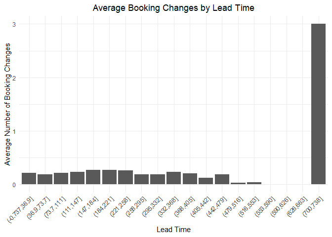<!-- -->

As shown in the graph there doesn’t seem to be too much change in
booking changes with lead time. It stays less than .5 average booking
changes until we get to the 700 to 738 day lead time range, then it
significantly spikes and the average number of booking changes is 3.
However, there are very few values in that range, so likely it was just
one booking that was changed 3 times.

The following graph demonstrates the relationship between whether a
customer is a returning guest and the number of booking changes made.

``` r
  ggplot(data, aes(x = is_repeated_guest, y = booking_changes, fill = is_repeated_guest)) +
  stat_summary(fun = mean, geom = "bar", width = 0.6) +
  labs(
    title = "Average Number of Booking Changes by Guest Type",
    x = "Guest Type",
    y = "Average Booking Changes"
  ) +
  theme_minimal() +
  theme(legend.position = "none",
    plot.title = element_text(hjust = 0.5)
  )
```

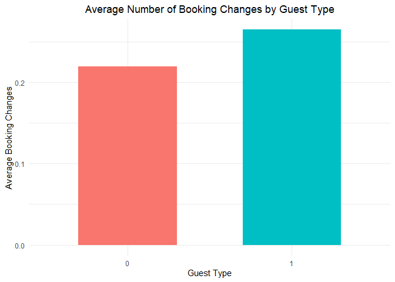<!-- -->

As shown in the graph we see that repeated guests have a slightly higher
chance of changing their bookings. However, both have a small average
number of booking changes with repeating guests being around 0.26
changes made on average and new guests being around 0.22 changes made on
average.

The following graph shows customer type vs number of booking changes
made.

``` r
# this reorders so that they go lowest to highest average num of booking changes
data <- data %>%
  group_by(customer_type) %>%
  mutate(avg_changes = mean(booking_changes, na.rm = TRUE)) %>%
  ungroup() %>%
  mutate(customer_type = reorder(customer_type, avg_changes))


ggplot(data, aes(x = customer_type, y = booking_changes, fill = customer_type)) +
  stat_summary(fun = mean, geom = "bar", width = 0.6) +
  labs(
    title = "Average Number of Booking Changes by Customer Type",
    x = "Customer Type",
    y = "Average Booking Changes"
  ) +
  theme_minimal() +
  theme(legend.position = "none",
    plot.title = element_text(hjust = 0.5)
  )
```

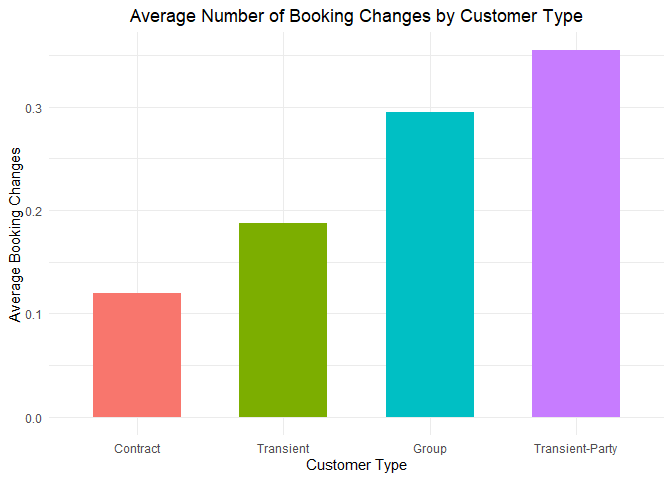<!-- -->

This graph shows that transient-party customer types are more likely to
make more booking changes than the others with an average number of
booking changes of about 0.35, and contract customers make the least
amount of booking changes with an average around 0.11.

Now we investigate the relationship between deposit type and number of
booking changes.

``` r
data %>%
  group_by(deposit_type) %>%
  summarise(
    avg_booking_changes = mean(booking_changes, na.rm = TRUE),
    .groups = "drop"
  ) %>%
  mutate(deposit_type = reorder(deposit_type, avg_booking_changes)) %>%
  ggplot(aes(x = deposit_type, y = avg_booking_changes, fill = deposit_type)) +
  geom_bar(stat = "identity") +
  geom_text(aes(label = round(avg_booking_changes, 2)), 
            vjust = -0.5, size = 4) +
  labs(
    title = "Average Number of Booking Changes by Deposit Type",
    x = "Deposit Type",
    y = "Average Booking Changes"
  ) +
  theme_minimal() +
  theme(legend.position = "none",
    plot.title = element_text(hjust = 0.5)
  )
```

<!-- -->

As you can see, refundable deposit types have a higher average number of
changes made to the bookings at 0.59 on average, wherease no deposit is
next at 0.25, and non refund has a very low number of changes on average
at 0.01.

### Where are most visitors coming from?

To answer this question we observe the country of origin of bookings
made.

``` r
country_counts <- data %>%
  group_by(country) %>%
  summarise(count = n()) %>%
  arrange(desc(count)) %>%
  top_n(10, count)  # limit to top 10 countries or else the graph is too big 

ggplot(country_counts, aes(x = reorder(country, -count), y = count, fill = country)) +
  geom_bar(stat = "identity") +
  theme_minimal() +
  labs(
    title = "Top Countries by Number of Hotel Bookings",
    x = "Country",
    y = "Number of Bookings"
  ) +
  theme(axis.text.x = element_text(angle = 45, hjust = 1),
    plot.title = element_text(hjust = 0.5)
  )
```

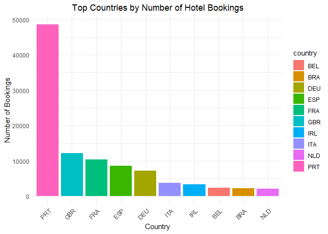<!-- -->

This information would be useful for these hotels to know which
countries to focus their advertising on. As shown in the graph, the top
10 countries for number of bookings made is Portugal, the UK, France,
Spain, Germany, Italy, Ireland, Belgium, Brazil, and the Netherlands.
However, Portugal by FAR has the most bookings with almost 5,000, and
the next largest is only around 1200 to 1300 bookings.

### Conclusion
